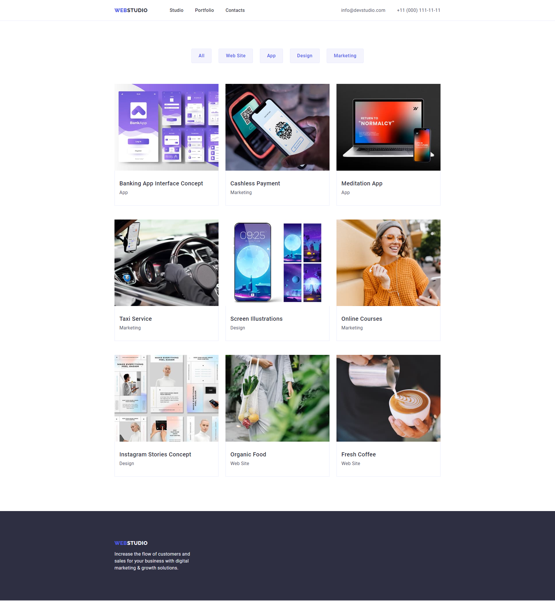

# WebStudio website

## Homework#03

Added styles for geometry (width, padding, margins, and borders) and content positioning with
Flexbox for
[Layout markup](<https://www.figma.com/file/3lQQ9l3yQYngZaAsfPkRSL/Web-Studio-(Version-2.1)-(Copy)?node-id=1%3A95&mode=dev>).
Configured GitHub Pages and added a [link](https://valerii2022.github.io/goit-markup-hw-03-FSON/) to
the live page in the GitHub-repository header.

### [Main Page](https://valerii2022.github.io/goit-markup-hw-03-FSON/)

### [Portfolio Page](https://valerii2022.github.io/goit-markup-hw-03-FSON/portfolio.html)

